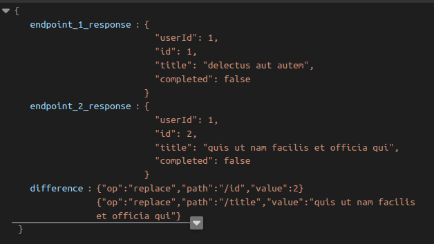

# Project Overview

## Objective
* The main objective of this project is to compare the json responses of the two endpoints with the help of a CLI application.

## Language & Packages 
* Go 1.18
* Cobra package

## Usage
* cli-app compare api_1 api_2
* Explanation : cli-app is the root command, compare is the subcommand and the arguments are the two endpoints to be tested
* Use compare --help to see more details about the command

## Output
* The estimated output as shown here

